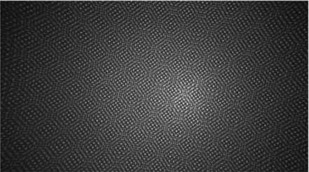

# ir-patterned-depth-image-generator
- This tool generates a depth image from two clean depth images obtained from simulation. 
- It adds an IR dot pattern—mimicking the Intel RealSense D415—to the images, and then computes the depth using a stereo BM (Block Matching) algorithm. 
- Note: This method was developed based on guidelines and information provided in the Intel [RealSense](https://dev.intelrealsense.com/docs/tuning-depth-cameras-for-best-performance)

<div align="center">

[](https://www.python.org/downloads/release/python-310/)
&nbsp;&nbsp;&nbsp;&nbsp;
</div>

<div align="center">
  <table>
    <tr>
      <td align="center">
        
        <br><b>IR Pattern</b>
      </td>
      <td align="center">
        
        <br><b>IR Patterned gray image</b>
      </td>
      <td align="center">
        
        <br><b>Generated Depth Image</b>
      </td>
    </tr>
  </table>
</div>

# 1. Setup
### 1. Dependencies
```bash
pip install -r requirements.txt
```

# 2. Running example code
### 1. apply_dot_depth.py
- This script adds an IR dot pattern to two clean images, and then generates a depth image using the stereo BM algorithm.

    ```bash
    python3 scripts/apply_dot_depth.py
    ```
### 2. stereo_bm_example.py
- This script simulates the depth image creation process by applying the stereo BM algorithm on two IR-patterned images (emulating the Intel RealSense D415).

    ```bash
    python3 scripts/stereo_bm_example.py
    ```

# 3. Prerequisites
- Clean depth images obtained from the simulation for both left and right views.
- Color images obtained from the simulation for both left and right views.
    - IR pattern will be added

# 4. Method
### 4.1 Overview of IR Depth Image Generation
- Intel RealSense D415 cameras utilize an IR projector to enhance depth extraction.
- The camera projects a pseudo-random IR dot pattern onto the scene, which improves stereo matching even in texture-less regions.
- The IR pattern is generated by merging dot patterns.

<div align="center">
  <table>
    <tr>
      <td align="center">
        
        <br><b>IR Pattern 1</b>
      </td>
      <td align="center">
        
        <br><b>IR Pattern 2</b>
      </td>
      <td align="center">
        
        <br><b>Generated Depth Image</b>
      </td>
    </tr>
  </table>
</div>

<div align="center">
  <table>
    <tr>
      <td align="center">
        
        <br><b>Real D415 IR Pattern</b>
      </td>
      <td align="center">
        
        <br><b>Real D415 IR Pattern (zoomed in)</b>
      </td>
      <td align="center">
        
        <br><b>Generated IR Pattern (zoomed in)</b>
      </td>
      <td align="center">
        
        <br><b>Generated IR Pattern</b>
      </td>
    </tr>
  </table>
</div>

- The disparity obtained from the left and right IR images is then converted into actual depth values using the camera's intrinsic parameters (e.g., focal length and baseline).

### 4.2 Role and Necessity of the IR Pattern
- Texture Augmentation: In many real-world scenes, flat or homogeneous surfaces lack sufficient texture for reliable stereo matching. 
- The IR pattern introduces artificial texture, making it easier for the matching algorithm to find correct correspondences.
- Enhanced Matching Accuracy: By providing additional visual features, the IR pattern enables more precise correspondence matching between the left and right images, which leads to a more accurate depth estimation.

### 4.3 IR Pattern Application in Simulation
- Clean Depth Image Preparation: In a simulated environment, left and right two clean depth images are generated.
- IR Pattern Addition: An IR dot pattern is then applied to the clean image, mimicking the effect of the D415’s IR projector. 

<div align="center">
  <table>
    <tr>
      <td align="center">
        
        <br><b>Generated clean left gray image </b>
      </td>
      <td align="center">
        
        <br><b>Generated clean right gray image </b>
      </td>
    </tr>
    <tr>
    <tr>
      <td align="center">
        
        <br><b>Generated patterned left gray image </b>
      </td>
      <td align="center">
        
        <br><b>Generated patterned right gray image </b>
      </td>
    </tr>
    <tr>
      <td align="center">
        
        <br><b>Generated patterned left gray image (zoomed in)</b>
      </td>
      <td align="center">
        
        <br><b>Generated patterned right gray image (zoomed in)</b>
      </td>
    </tr>
    <tr>
      <td align="center">
        
        <br><b>Real D415 left ir gray image </b>
      </td>
      <td align="center">
        
        <br><b>Real D415 right ir gray image </b>
      </td>
    </tr>
  </table>
</div>

### 4.4 Depth Image Generation Using Stereo BM
- Stereo Matching Execution: The IR-patterned left and right image pair is processed using the stereo Block Matching (BM) algorithm.
- This algorithm identifies corresponding points between the two images by computing pixel disparities.
- Disparity-to-Depth Conversion: The disparity map obtained from the stereo BM algorithm is converted into a depth map by using the camera calibration parameters (such as focal length and baseline).
<div align="center">
  <table>
    <tr>
      <td align="center">
        
        <br><b>Generated depth image </b>
      </td>
    </tr>
    <tr>
    <tr>
      <td align="center">
        
        <br><b> D415 depth image </b>
      </td>
    </tr>
    </tr>
  </table>
</div>
